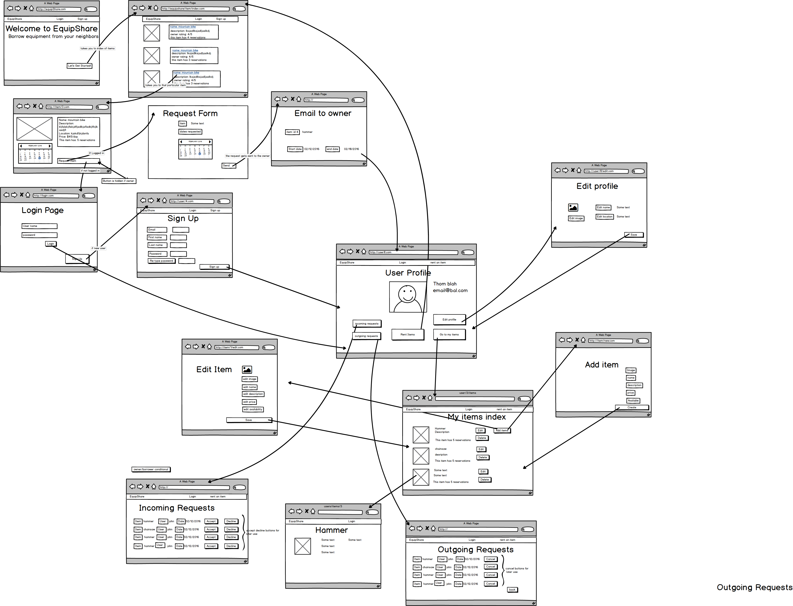

#EquipShare

[EquipShare on heroku](https://equipshare.herokuapp.com/)

###About EquipShare

**EquipShare** is about building a stronger community and expanding your capabilities. EquipShare allows users to borrow and lend out personal items, such as power tools or even kayaks. By being able to take advantage of your neighbors resources, you’ll be able to experience new things as well as increase productivity without having to spend a lot of money. The app allows you to see the items available, request a date for use and initiates communication between the owner and borrower.  

###Technologies
Ruby on Rails

Html

css

###Installation Guide
bundle install

###User Stories
User stories for EquipShare
EquipShare

A user can go to a splash page.

A user can see a nav bar and login/signup and rent tabs.

A user can see a welcome page with a button, “let’s get started!”

A user can click on “let’s get started!” button and be redirected to the items index page.

A user can click on an item and be directed to it's show page. The item's show page will contain more information about the item. A calendar to see dates the items is reserved. On the item's show page, a user can see a button to request item. 

A user can click on a “request item” button, If they're not logged in they will be taken to a login page.
On “request” button push, a user will see a form with item name and other information as well as a calendar that allows you to pick the date you wish to request an item. The user will see a send a button. (For MVP this will send at the user an email to open communication between the owner and borrower.)

 On the login page the user will see a username field and password field  and a login button at the bottom. There will be a sign up button as well, in case they're a new user and need to sign up-redirected to sign up page with form.
 
A user can click on the sign up page and be directed to a page with a form for creating a new user with empty text fields. There will be a “sign up” button at the bottom.

After logging in or signing up a user will be directed to their profile page. 

On the profile a user will be able to see User information as well as  buttons for “outgoing request”, “incoming request”, “my items” , “edit profile” and “rent items”.

In the profile page a user can click on “outgoing requests” and be directed to a page with a list of the users outgoing requests. (for later: each requests will have a status as well as a “cancel” button to soft delete the request) the user will see a “back” button that will redirect the user back to their profile.
From the profile a User can click on the “incoming request” button and be directed to a page showing all of the users incoming requests(for later: each requests will have an “accept” and “decline” button.). A user can see a “back” button at the bottom of the page that will redirect the user to the profile page.

From the profile a User can click on the “my items” button and be directed to a page showing all of the items that they own. Next to each item the user will see a button “edit”  which will direct you to an item edit page where the user will be able to update item information. A  “delete” button will allow the user to remove an item from the entire item index, on click the user will be prompted”Are you sure you want to delete item #”. Clicking on the item will direct the user to the item’s show page, since they own this item the “request item button will not a appear and instead will be replaced by a “back” button that will redirect the user to the profile page. Also  on the page the user will see an “add item” button, this will redirect the user to a new page with an empty form for adding a new item. 

In the profile page a user can click on “Edit profile” and be directed to a page with a form of the user attributes allowing them to update it. The user will see a “save” button that will redirect the user back to their profile.

From the profile a user can click on the “Rent items” button and be directed to the items index page.  

###Wireframes

[Entitiy relationship diagrams](link goes here)

###Future Features
* Owners will be able to choose whether to accept or decline requests.
* Users will be able to see the availability of a request.
* Users will be based on location.